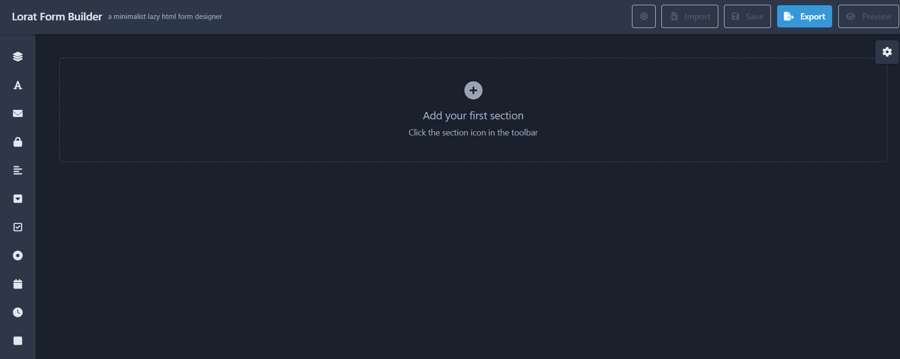

# Lorat Form Builder

A minimalist, lazy, HTML form designer built with Vue 3. Create forms visually by dragging and dropping elements, then export the generated HTML code or save/load your design as JSON.



## Features

*   **Drag & Drop Interface:** Intuitively build forms by dragging elements from the toolbar onto sections.
*   **Visual Editing:** Click on any element or section to edit its properties in the side panel.
*   **Multiple Form Elements:** Supports Text Fields, Emails, Passwords, Text Areas, Dropdowns, Checkboxes, Radio Groups, Date Pickers, Time Pickers, and Buttons.
*   **Section Management:** Organize your form into collapsible sections with titles and descriptions.
*   **Real-time Preview:** See how your form will look with a full-screen preview mode.
*   **Export Functionality:**
    *   **HTML Code:** Generate clean, semantic HTML for your form.
    *   **JSON Data:** Save your entire form design as a JSON file for later loading.
*   **Import Functionality:** Load a previously saved form design from a JSON file.
*   **Dark Mode:** Switch to a comfortable dark theme for low-light environments.
*   **Responsive Design:** Built with Tailwind CSS for a layout that adapts to different screen sizes (builder UI).

## Getting Started

### Prerequisites

You need a modern web browser (Chrome, Firefox, Safari, Edge) to run this application. No additional software installation is required.

### Running the Application

1.  **Download:** Clone or download this repository to your local machine.
    ```bash
    git clone https://github.com/syahman/lorat.git
    ```
2.  **Open:** Locate the main HTML file (e.g., `lorat.html` or `index.html`) in your file explorer.
3.  **Launch:** Double-click the HTML file to open it in your default web browser.

That's it! The Lorat Form Builder is now ready to use directly in your browser.

## How to Use

1.  **Add a Section:** Click the 'Section' icon (fa-layer-group) in the left toolbar.
2.  **Add Elements:** Drag elements (Text Field, Email, etc.) from the toolbar and drop them into a section.
3.  **Edit Properties:** Click on a section title or an element within a section. The property panel on the right will populate with editable fields (Label, Placeholder, Required, Options, etc.).
4.  **Organize Elements:** Click and drag elements within a section to reorder them.
5.  **Preview:** Click the 'Preview' button in the top right to see a full-screen simulation of your form.
6.  **Export:**
    *   Click the 'Export' button.
    *   Choose the 'HTML Code' tab to copy the generated HTML.
    *   Choose the 'JSON Data' tab to copy or download the design data.
7.  **Save/Load Design:**
    *   To Save: Click 'Export' -> 'JSON Data' -> 'Download'.
    *   To Load: Click 'Import' and select your saved `.json` file.
8.  **Dark Mode:** Click the Moon/Sun icon in the top right header to toggle between light and dark themes.

## Built With

*   [Vue.js 3](https://v3.vuejs.org/) - The Progressive JavaScript Framework
*   [Tailwind CSS](https://tailwindcss.com/) - A utility-first CSS framework
*   [Font Awesome](https://fontawesome.com/) - Icon toolkit

## Contributing

Contributions are welcome! Feel free to fork the repository, make changes, and submit pull requests.

## Acknowledgments

*   Inspired by the need for simple, no-fuss form building tools.
